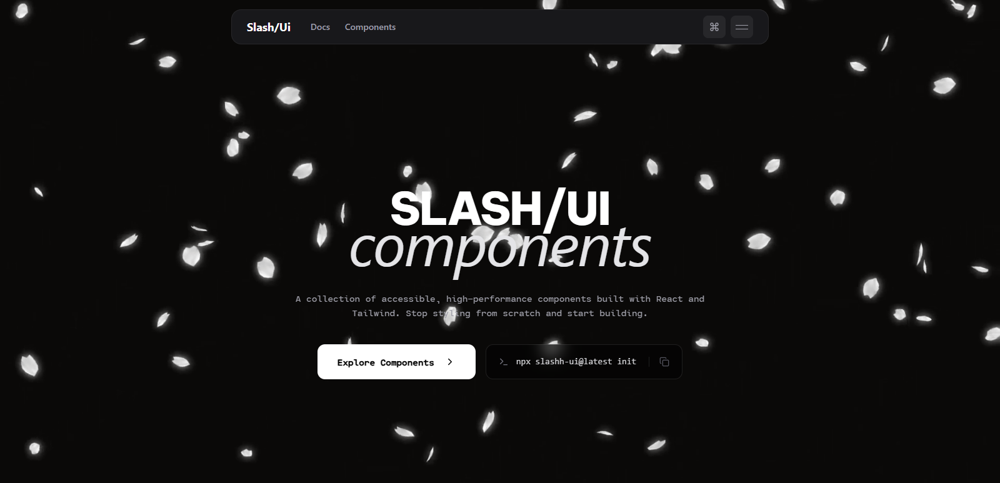

<div align="center">



<br />

# Slash UI

A modern component library for the web — crafted for developers who care about motion, feel, and detail.

<br />

[Browse Components](#components) · [Quick Start](#quick-start) · [CLI Usage](#cli-usage) · [Contributing](#contributing)

</div>

---

## What is Slash UI?

Slash UI is a CLI-powered component library for Next.js and React apps. It ships production-ready UI components with modern motion design — hover effects, preloaders, transitions, scroll animations, loaders, cursors, and more.

Unlike traditional component libraries, Slash UI copies components directly into your project — giving you full ownership and control over every line of code.

---

## Features

- CLI-first — add components directly into your codebase
- Motion-ready — every component is built with animation in mind
- Custom cursors, preloaders, transitions, scroll effects and more
- Modular — only add what you need, nothing more
- Fully customizable — edit components freely after adding them

---

## Quick Start

**1. Install the package**

```bash
npm install @ghatak/slash-ui --ignore-scripts
```

**2. Add a component**

```bash
npx slash-ui add <component-name>
```

**3. Use it in your project**

```tsx
import { ButtonPulse } from '@/components/ui/buttons/ButtonPulse'

export default function Page() {
  return <ButtonPulse>Get Started</ButtonPulse>
}
```

---

## CLI Usage

```bash
npx slash-ui [command]
```

| Command | Description |
|--------|-------------|
| `npx slash-ui list` | List all available components |
| `npx slash-ui add <name>` | Add a component to your project |

---

## Components

### Buttons
Animated, interactive button variants with hover effects.

```bash
npx slash-ui add button-magnetic
```

### Cursors
Custom cursor effects that replace or enhance the default browser cursor.

```bash
npx slash-ui add cursor-dot
```

### Navbars
Modern navigation bars with scroll-aware behavior.

```bash
npx slash-ui add navbar-glass
```

### Scrollbars
Styled and animated scrollbar components.

```bash
npx slash-ui add scrollbar-smooth
```

### Preloaders & Loaders
Page entry animations and loading states.

```bash
npx slash-ui add preloader-fade
```

### Transitions
Smooth page and element transition effects.

```bash
npx slash-ui add transition-slide
```

---

## Requirements

- Next.js 13+
- React 18+
- Tailwind CSS v3+
- Node.js 18+

---

## Project Structure

After adding components, they will appear in your project like this:

```
your-project/
└── components/
    └── ui/
        ├── buttons/
        ├── cursors/
        ├── navbars/
        └── scrollbars/
```

You own the code — edit freely.

---

## Contributing

Contributions are welcome. If you have a component idea or want to improve an existing one:

1. Fork the repository
2. Create a new branch: `git checkout -b feat/your-component`
3. Build your component inside `src/registry/ui/`
4. Submit a pull request

---

## License

MIT © [Rahul Ghatak](https://github.com/ghatak)
